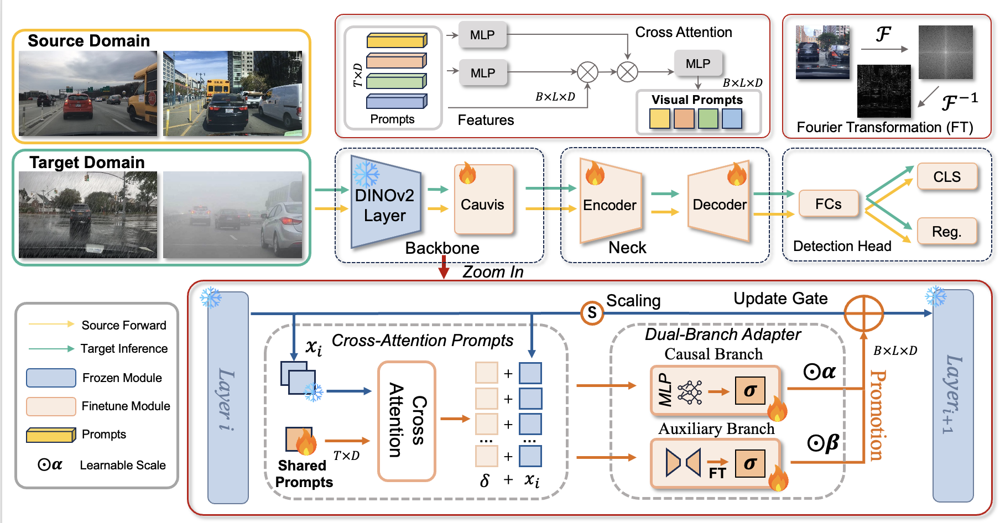

# Cauvis

Towards Single-Source Domain Generalized Object Detection via Causal Visual Prompts
<div align="center">
    Chen Li, Huiying Xu, Changxin Gao <sup>*</sup>, Zeyu Wang, Yun Liu, Xinzhong Zhu <br>
    <sup>1</sup> Huazhong University of Science and Technology, 
    <br>
    * Corresponding Author.
    <br>
</div>

<div align="center">
    
</div>

> **TL;DR**: Cauvis (Causal Visual Prompts) tackles single-source domain generalized object detection by combining cross-attention visual prompts with a dual-branch adapter. The prompts suppress spurious correlation, while the adapter disentangles causal vs. non-causal features and adapts via high-frequency (Fourier) extraction, delivering state-of-the-art gains on SDGOD benchmark and Cityscapes-C.


---

## News
- **2025-10-15**: Code released; training logs for Cityscapes-C / BDD100K-C are now available.
- **2025-09-18**: Paper accepted to NeurIPS 2025 🎉

---

## Table of Contents
- [Installation](##installation)
- [Data Preparation](##DataPreparation)
- [Results](##Results)
- [Train / Eval](##TrainEval)
- [Pretrained Weights](##Pretrained)

## Installation
### Pretrained DINOv2 
Our DINOv2 weights here are primarily derived from [Rein](https://github.com/w1oves/Rein) repository
* **Download:** Download pre-trained weights from [facebookresearch](https://dl.fbaipublicfiles.com/dinov2/dinov2_vitl14/dinov2_vitl14_pretrain.pth) .
* **Convert** 
  ```bash
  python tools/convert_models/convert_dinov2.py checkpoints/dinov2_vitl14_pretrain.pth checkpoints/dinov2_converted_1024.pth --height 1024 --width 1024
  ```
  
### environment
```bash
conda create -n cauvis -y python=3.10
pip3 install torch==2.2.0 torchvision==0.17.0 --index-url https://download.pytorch.org/whl/cu118
pip install -r ./requirements.txt
pip install albumentations==1.4.4 timm einops
pip install -U openmim
mim install mmengine
mim install mmcv==2.2.0
#git clone https://github.com/open-mmlab/mmcv.git
#cd mmcv && pip install -r requirements/optional.txt && pip install -e . -v
pip install xformers==0.0.24 # torch 2.2
pip install -v -e .
pip install numpy==1.26.0
```

## DataPreparation
Download the [SDGOD]((https://github.com/AmingWu/Single-DGOD)) dataset and organize it in `dataset` folder as follows:
```
|-- Single-DGOD/
|   |-- Daytime_Sunny/
|   |   |-- daytime_clear/
|   |       |-- VOC2007
|   |           |-- Annotations
|   |               |-- 0a0a0b1a-7c39d841.xml
|   |               |-- ...xml
|   |           |-- ImageSets
|   |               |-- Main
|   |                   |-- train.txt
|   |                   |-- ...txt
|   |           |-- JPEGImages
|   |               |-- 0a0a0b1a-7c39d841.jpg
|   |-- DaytimeFoggy/
|   |-- Dusk-rainy/
|   |-- Night_rainy/
|   |-- Night-Sunny/
```


## Results

**Performance on SDGOD:**

| Model  | Day Clear | Day Foggy | Dusk Rainy | Night Rainy | Night Clear | Avg. |                     Log                      |
|:------:|:---------:|:---------:|:----------:|:-----------:|:-----------:|:----:| :------------------------------------------: |
| Cauvis |   73.7    |   56.5    |    64.6    |    47.6     |    61.2     | 60.7 |  [log](resources/sdgod/Cauvis_DINOv2.log) |

**Comparison with SOTA PEFT Method on SDGOD:**

| Model  | Backbone | Day Clear | Day Foggy | Dusk Rainy | Night Rainy | Night Clear | Avg. |                     Log                      |
|:------:|:--------:|:---------:|:---------:|:----------:|:-----------:|:-----------:|:-----------:| :------------------------------------------: |
| Cauvis | DINOv2-L |   73.7    |   56.5    |    64.6    |    47.6     |    61.2     | 60.7 |  [log](resources/sdgod/Cauvis_DINOv2.log) |
| Cauvis |  SAM-H   |   72.2    |   53.7    |    55.8    |    31.5     |    55.7     | 53.8 |  [log](resources/sdgod/Cauvis_SAM.log) |
| Cauvis | EVA02-L  |   69.7    |   50.2    |    57.6    |    34.2     |    48.1     | 52.0 |  [log](resources/sdgod/Cauvis_EVA02.log) |


**Corruption Detection Performance for Cityscpaes-C:**

| Model  |  Detector  | Guass | Shot | Impul | Defocus | Glass | Motion | Zoom | Snow | Frost | Foggy | Bright | Contrast | Elas |  Pixel   | JPEGImages |    mPC    |                        Log                        |
|:------:|:----------:|:-----:|:----:|:-----:|:-------:|:-----:|:------:|:----:|:----:|:-----:|:------:|:-----:|:--------:|:----:|:--------:|:----------:|:---------:|:-------------------------------------------------:|
| Cauvis | FasterRCNN | 16.8  | 19.8 | 15.2  |  41.4   | 34.0  |  39.2  | 15.8 | 29.8 | 36.7  |  48.8  |   53.0   | 49.5 | 52.0 |    43.9  |    38.8    |    35.6   | [log](resources/cityscapes/Cauvis_cityscapes.log) |


**Corruption Detection Performance for BDD100k-C:**

| Model  |  Detector  | Guass | Shot | Impul | Defocus | Glass | Motion | Zoom | Snow | Frost | Foggy | Bright | Contrast | Elas | Pixel | JPEGImages | mPC  |                       Log                        |
|:------:|:----------:|:-----:|:----:|:-----:|:-------:|:-----:|:------:|:----:|:----:|:-----:|:-----:|:------:|:--------:|:----:|:-----:|:----------:|:----:|:------------------------------------------------:|
| Cauvis | FasterRCNN | 34.4  | 36.5 | 33.3  |  44.3   | 41.1  |  43.1  | 21.6 | 41.1 | 42.3  | 54.8  |  53.9  |   54.0   | 51.2 | 51.3  |    50.4    | 43.6 | [log](resources/bdd100k_c/cauvis_fasterrcnn.log) |

## TrainEval

**Train on SDGOD**
```shell
# train
bash tools/dist_train.sh configs/cauvis/cauvis_dinov2_dinohead_bs1x4_sdgod.py 8 --amp --work-dir ./work_dir/cauvis --find_unused_parameters
# test
bash tools/dist_test.sh configs/cauvis/cauvis_dinov2_dinohead_bs1x4_sdgod.py path/to/your.pth 8 --work-dir ./work_dir/test_cauvis
```

**Validating Performance on Cityscapes-C**

```shell
# Train on Source Domain (Cityscapes)
bash tools/dist_train.sh configs/cauvis/cauvis-faster-rcnn_r50_fpn_cityscapes.py 8 --amp --work-dir ./work_dir/cauvis --find_unused_parameters

# test on Target Domain
bash tools/dist_test_robustness.sh configs/cauvis/cauvis-faster-rcnn_r50_fpn_cityscapes.py path/to/your/epoch_12.pth 8 --out path/to/your/xxx.pkl --work-dir ./work_dir --corruptions benchmark
# next step
python tools/analysis_tools/test_robustness.py configs/cauvis/cauvis-faster-rcnn_r50_fpn_cityscapes.py path/to/your.pth --out /path/to/xxx.pkl --work-dir ./work_dir --corruptions benchmark 
```

## Pretrained
We re-ran the experiments with this codebase on 4×RTX 4090 GPUs and provide the resulting checkpoints below.

| Model  | Dataset / Setting               | Link |
|------- |---------------------------------|------|
| Cauvis | SDGOD, Cauvis + DINOv2 ViT-L/14 | [Google Drive](https://drive.google.com/file/d/1ZjddVB0h4ZYjZ3g2ve6BsQUamvOidTxj/view?usp=sharing) |

| Model  | Day Clear | Day Foggy | Dusk Rainy | Night Rainy | Night Clear | Avg. |
|:------:|:---------:|:---------:|:----------:|:-----------:|:-----------:|:----:| 
| Cauvis |   74.2    |   56.5    |   65.0    |    47.5     |    60.6     | 60.8 |  
**Usage**
1. Download the file from the link above.
2. Place it under `weights/` (create the folder if it doesn’t exist), e.g.: `weights/cauvis_dinohead.pth`
3. Run evaluation:

```bash
python tools/test.py \
  configs/cauvis/cauvis_dinov2_dinohead_bs1x4_sdgod.py \
  weights/cauvis_dinohead.pth
```

> Tip: if you keep checkpoints elsewhere, pass the path via `/path/to/your_checkpoint.pth`.


## Acknowledgment
Our implementation is mainly based on [MMdetection](https://github.com/open-mmlab/mmsegmentation) and [Rein](https://github.com/w1oves/Rein). Thanks for their authors.